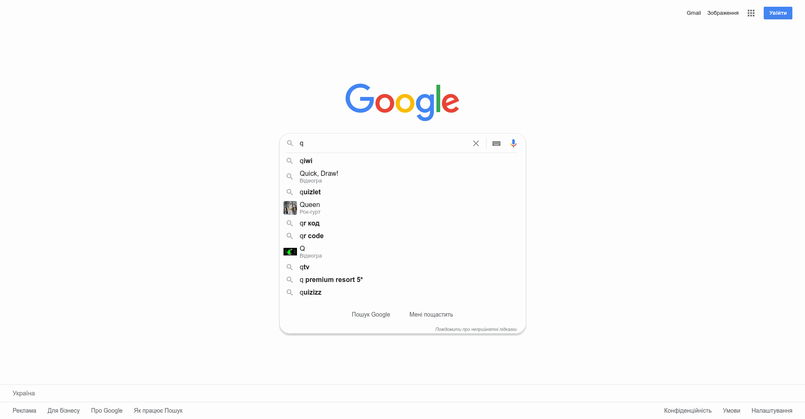
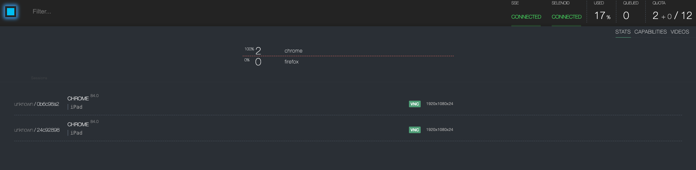

# General information
Automation test framework for API, UI, visual testing using Java 14, Selenide, Selenoid, Rest Assured, Junit

# Frameworks and tools
- [Selenide](https://github.com/selenide/selenide/)
- [Selenoid](https://aerokube.com/selenoid/latest/)
- [Rest-Assured](http://rest-assured.io/)
- [Allure](https://docs.qameta.io/allure/)
- [AssertJ](https://github.com/joel-costigliola/assertj-core/)
- [Jackson](https://github.com/FasterXML/jackson/)
- [JUnit](https://github.com/junit-team/junit5)
- [Owner](https://github.com/lviggiano/owner)
- [aShot](https://github.com/pazone/ashot)

# Setup test environment
Execute from jenkins folder:
 ```bash
     docker build -t custom_jenkins .
  ```
Pull needed images with browse:
 ```bash
    docker pull selenoid/vnc_chrome:85.0
    docker pull selenoid/vnc_firefox:79.0
    docker pull selenoid/video-recorder:latest-release
  ```
Setup environmet:
 ```bash
    docker-compose up -d
  ```

###Launch from command line
```bash
    ./gradlew clean ${task} -Dconfig=${config}
 ```
where:
 - ${task}=(ui | api)
 - ${config} = (CHROME_FULL_HD | CHROME_HD | FIREFOX_FULL_HD | MOBILE_RESOLUTION | IPAD_RESOLUTION | LOCAL)
 
executing api tests:
```bash
    ./gradlew clean api
 ```

executing ui tests on chrome:
```bash
    ./gradlew clean ui -Dconfig=CHROME_FULL_HD
 ```

###Vusual testing


###UI test execution
Framework support executing tests in parallel mode and with different configuration:

